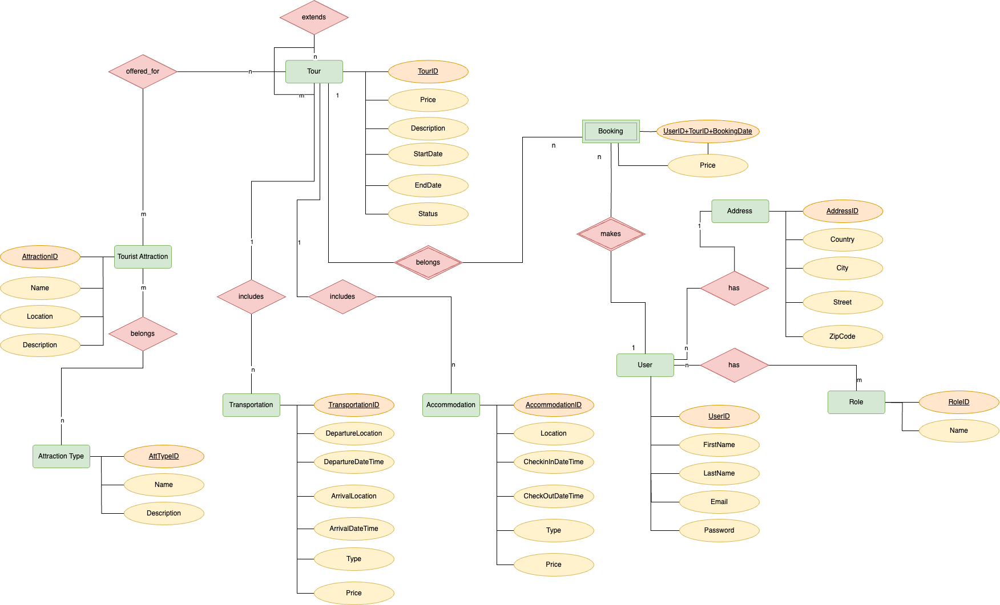

#  Web System Based On NoSQL And Relational Database Models

## Project Overview

The project involves the design and development of a web system for a travel agency. The goal is to utilize NoSQL and relational database models for the same domain, explore how their structures differ, and how the NoSQL model can be optimized by taking into account its characteristics.

The system supports: 
- Filling data in a MySQL DB. 
- Data Migration from MySQL to MongoDB.
- Switching between MySQL and MongoDB.
- Domain-related functionalities using either of the database models.

## Entity-Relationship Model 



## NoSQL Design Decisions

 The NoSQL database comprises 4 collections, containing all the 9 entities along with their attributes defined in the relational database model. The key consideration for the structure of the documents is whether to use embedding or referencing. Below I descibe all the decisions that I made taking into consideration my application's need.

- **Tour embeds bookings** - Given that the bookings are very unlikely to change once they have been created, and considering that the report lists the most booked tours, I’ve decided to embed the bookings in the tour collection to avoid unnecessary joins and make use of the read performance advantages that embedding offers.
- **Tour embeds accommodations and transportations** - Both accommodation and transportation belong to one tour. Within our application, they are always expected to appear in the context of a tour and are not likely to frequently change. In the UI, while showing the details of a tour, the accommodation and transportation data are also being shown along with it, which improves the performance by avoiding unnecessary join operations.
- **Tour references other tours** - Because of the many-to-many relationship among tours, direct embedding wouldn’t bring any benefits. Updates to any single tour would cause cascading changes across all the related tours, complicating maintenance and potentially degrading performance due to frequent writes.
- **Tour references tourist attractions** - There is a many-to-many relationship here. In a real-life application, the tourist attractions data would be accessed on its own so that the travel agency manager could include them in tours. There would be a need to update the data, and this would mean propagating the changes to all the tours that embed them.
Therefore, I think referencing provides flexibility and simplifies updates by isolating tourist attractions in their own documents.

**Tour Document Example:**

```javascript
{
   _id: 16,
   price: Decimal128("220.00"),
   description: 'The tour will take place 21/04/2026 - 29/04/2026 and will cost 220$.',
   startDate: ISODate("2026-04-20T23:00:00.000Z"),
   endDate: ISODate("2026-04-29T13:52:00.000Z"),
   status: 'Active',
   bookings: [
       {
           bookingDate: ISODate("2025-02-13T19:04:00.000Z"),
           price: '220.00'
       },
       {
           bookingDate: ISODate("2024-09-25T18:12:00.000Z"),
           price: '220.00'
       },
       {
           bookingDate: ISODate("2025-03-14T13:44:00.000Z"),
           price: '220.00'
       },
       {
           bookingDate: ISODate("2025-08-07T12:40:00.000Z"),
           price: '220.00'
       },
       {
           bookingDate: ISODate("2025-02-08T03:56:00.000Z"),
           price: '220.00'
       }
   ],
   accommodations: [
       {
           location: '-7.7333, 54.9480',
           checkInDateTime: ISODate("2026-04-25T03:03:00.000Z"),
           checkOutDateTime: ISODate("2026-04-26T03:00:00.000Z"),
           type: 'Tent',
           price: '45.00'
       },
       {
           location: '-9.3152, 53.7649',
           checkInDateTime: ISODate("2026-04-27T08:43:00.000Z"),
           checkOutDateTime: ISODate("2026-04-28T08:43:00.000Z"),
           type: 'Apartment',
           price: '90.00'
       }
   ],
   transportations: [
       {
           departureLocation: '-8.4781, 51.8986',
           departureDateTime: ISODate("2026-04-25T14:38:00.000Z"),
           arrivalLocation: '-7.7333, 54.9480',
           arrivalDateTime: ISODate("2026-04-26T21:38:00.000Z"),
           type: 'Bus',
           price: '55.00'
       },
       {
           departureLocation: '-9.5254, 52.0208',
           departureDateTime: ISODate("2026-04-23T14:33:00.000Z"),
           arrivalLocation: '-7.1119, 52.2610',
           arrivalDateTime: ISODate("2026-04-28T00:05:00.000Z"),
           type: 'Train',
           price: '30.00'
       }
   ],
   includedTourIds: [],
   touristAttractionIds: [ 2, 13, 16, 23 ]
}
```

- **Tourist attraction embeds attraction types** - Although there is a many-to-many relationship here, the tourist attraction type is not that likely to change once the tourist attraction has been created. Moreover, the tourist attraction type is accessed in the context of a tourist attraction while generating the report. In my opinion, the frequency of data reads significantly outweighs that of updates in this case.

**Tourist Attraction Document Example:**

```javascript
{
   _id: 3,
   name: 'Muckross Friary',
   location: '-9.504292,52.018083',
   description: 'http://www.heritageireland.ie/en',
   attractionTypes: [
       {
           name: 'Historic Site',
           description: 'An official location where pieces of political, military, cultural, or social history have been preserved due to their cultural heritage value.'
       },
       {
           name: 'Natural Landscape',
           description: 'The original landscape that exists before it is acted upon by human culture.'
       }
   ]
}
```
- **User embeds Role** - The roles are very unlikely to change once they have been created, so I decided to embed them in the user document.
User embeds bookings - Booking belongs to one user and is very unlikely to change once created. Moreover, in the application, the user has the capability to view their booking history. The embedded ‘booking’ here differs from the one in the ‘tour’ document, as it has a reference to the ‘tour’ it belongs to. This is necessary because the user can view the tour details, while checking their booking history.
- **User references address** - Since an address can belong to many users, any changes to an address must be propagated among all associated users. Hence, I decided to use referencing instead.

**User Document Example:**

```javascript
{
   _id: 5,
   firstName: 'William',
   lastName: 'Brown',
   email: 'williamB@example.com',
   password: 'pass',
   address_id: 8,
   roles: [ { name: 'User' } ],
   bookings: [
       {
           tourId: 1,
           bookingDate: ISODate("2025-07-02T06:47:00.000Z"),
           price: Decimal128("240.00")
       },
       {
           tourId: 5,
           bookingDate: ISODate("2024-07-12T08:09:00.000Z"),
           price: Decimal128("1010.00")
       },
       {
           tourId: 12,
           bookingDate: ISODate("2024-11-13T16:41:00.000Z"),
           price: Decimal128("1745.00")
       },
       {
           tourId: 24,
           bookingDate: ISODate("2024-10-10T20:07:00.000Z"),
           price: Decimal128("1040.00")
       },
       {
           tourId: 36,
           bookingDate: ISODate("2024-08-16T16:25:00.000Z"),
           price: Decimal128("185.00")
       },
       {
           tourId: 45,
           bookingDate: ISODate("2024-07-05T22:37:00.000Z"),
           price: Decimal128("1200.00")
       }
   ]
}
```

## Comparison

Let's consider a use-case that is supported by the system: generting a report of top tours in the agency under 500€.

For the MySQL version there are many joins as data from five different tables were required to gather the final result, while for the MongoDB version only the `touristAttraction` collection is joined, the rest is embedded in the `tour` document.

**MySQL Query:**
```sql
Select t.Id 'Tour Id', 
       Count(b.TourId) 'Number of bookings', 
       t.Description 'Tour Description', 
       t.Price 'Tour Price',
       at.Name 'Attraction Type Name', 
       ta.Name 'Tourist Attraction Name', 
       ta.Location 'Tourist Attraction Location' 
from Tour t
Join TourTouristAttraction tta on t.Id = tta.TourId
Join TouristAttraction ta on ta.Id = tta.TouristAttractionId
Join AttractionTypeTouristAttraction atta on ta.Id = atta.TouristAttractionId
Join AttractionType at on at.Id = atta.AttractionTypeId
Join Booking b on b.TourId = t.Id
Where at.Name = 'Natural Landscape' and t.Price < 500
Group by t.Id, ta.Name, ta.Location, t.Price, at.Name
Order by Count(b.TourId) desc, t.Id desc
```
**MongoDB Pipeline:**

```javascript
db.tours.aggregate([
  {
    $addFields: {
      numberOfBookings: { $size: "$bookings" }
    }
  },
  {
    $match: {
      numberOfBookings: { $gt: 0 },
      price: { $lt: 500 }
    }
  },
  {
    $lookup: {
      from: "touristAttractions",
      localField: "touristAttractionIds",
      foreignField: "_id",
      as: "attractions"
    }
  },
  {
    $unwind: "$attractions"
  },
  {
    $unwind: "$attractions.attractionTypes"
  },
  {
    $group: {
      _id: {
        tourId: "$_id",
        attractionName: "$attractions.name",
        attractionLocation: "$attractions.location",
        price: "$price",
        attractionTypeName: "$attractions.attractionTypes.name"
      },
      numberOfBookings: { $first: "$numberOfBookings" },
      description: { $first: "$description" }
    }
  },
  {
    $match: {
      "_id.attractionTypeName": "Natural Landscape"
    }
  },
  {
    $sort: {
      numberOfBookings: -1,
      "_id.tourId": -1
    }
  },
  {
    $project: {
      _id: 0,
      tourId: "$_id.tourId",
      numberOfBookings: 1,
      description: 1,
      price: 1,
      attractionTypeName: "$_id.attractionTypeName",
      attractionName: "$_id.attractionName",
      attractionLocation: "$_id.attractionLocation"
    }
  }
]);
```
## Running the Application

To start the application, run the following command in your terminal:

```bash
docker-compose up --build
```

This will launch three containers: `webapp`, `mySqlDB`, and `mongoDB`.

Once the containers are up and running, the application can be accessed through the following URL: <http://localhost:8001/>
